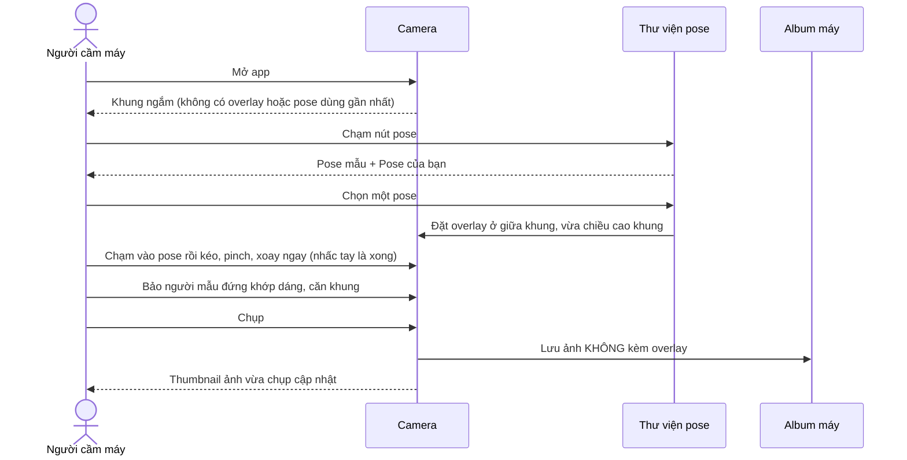
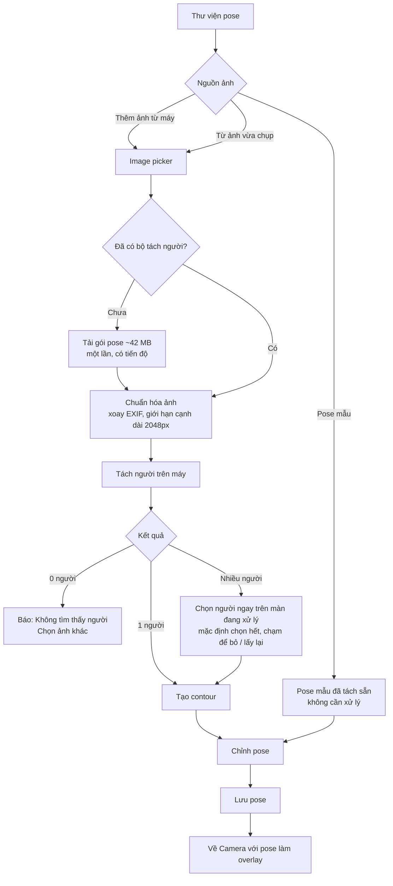
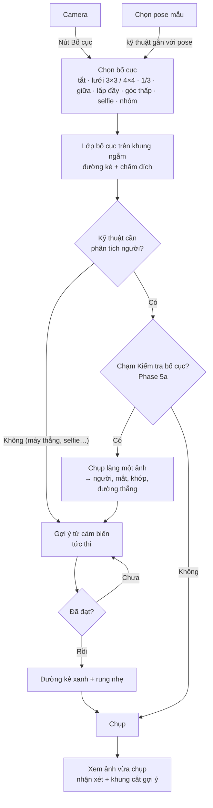
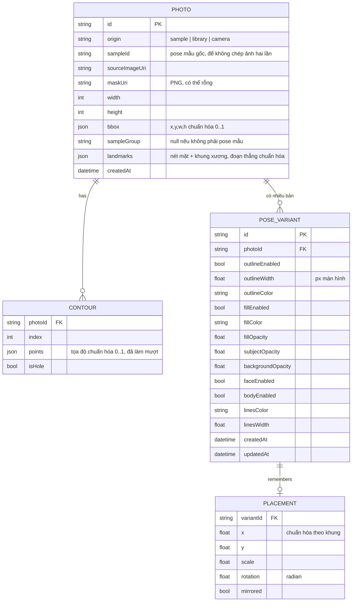
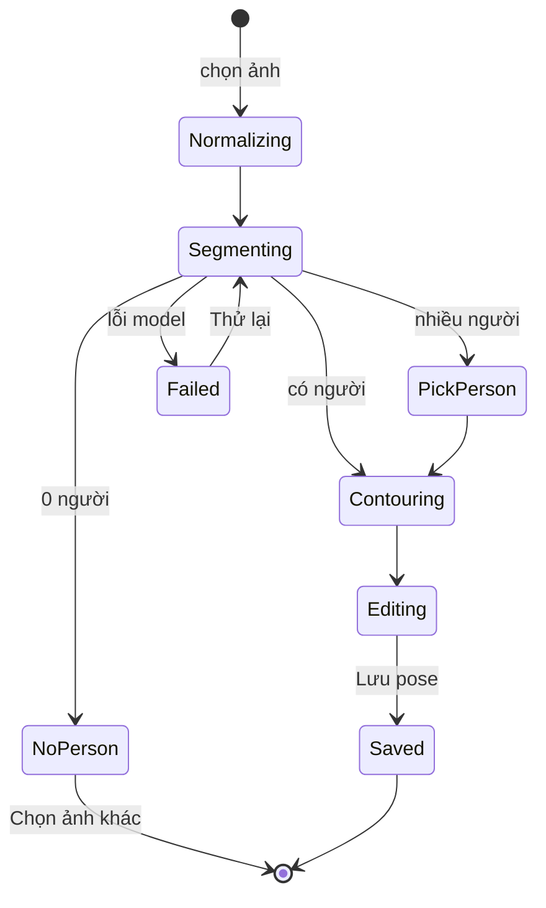
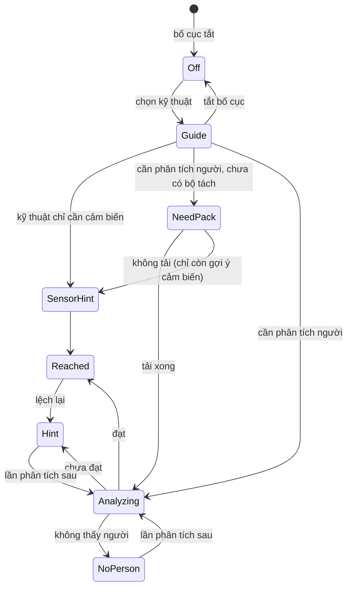

# SnapShot — Business flow

> Tài liệu nghiệp vụ cho bản rebuild. Mô tả **app làm gì, cho ai, theo luồng nào và theo quy tắc nào**.
> Cách làm kỹ thuật ở [roadmap.md](roadmap.md), giao diện ở [design.md](design.md).

---

## 1. Sản phẩm trong một câu

**SnapShot là app camera chụp theo dáng mẫu:** tách dáng người từ một ảnh mẫu, đặt dáng đó lên khung ngắm làm lớp hướng dẫn, rồi chụp người thật theo đúng dáng. Cùng lúc, **trợ lý bố cục** hướng dẫn đặt người ở đâu trong khung và cầm máy góc nào theo các kỹ thuật của nghề ảnh, kèm thẻ học từng kỹ thuật.

Phạm vi v1: **iOS và Android (chạy trong Expo Go), chỉ tiếng Việt, chạy hoàn toàn trên máy, không có server**, là đồ án portfolio.

### Người dùng

| Vai trò | Họ cần gì | Dùng chức năng |
|---|---|---|
| **Người cầm máy** (bạn bè, người yêu, nhiếp ảnh nghiệp dư) | Biết cần bảo người mẫu đứng thế nào, căn khung ra sao | 1 — Chụp theo pose, 3 — Trợ lý bố cục |
| **Người được chụp** | Xem nhanh dáng cần tạo, so với dáng mình đang đứng | 1 — Chụp theo pose |
| **Người sưu tầm dáng** (content creator, người hay chụp ảnh du lịch) | Lưu dáng đẹp thấy trên mạng thành thư viện riêng | 2 — Tạo và chỉnh pose |
| **Người mới tập chụp** | Biết đặt người ở đâu trong khung, cầm máy góc nào, tránh lỗi hay gặp; học dần kỹ thuật | 3 — Trợ lý bố cục |

---

## 2. Thuật ngữ (dùng thống nhất trong code, UI và tài liệu)

| Thuật ngữ | Nghĩa | Tên trong code |
|---|---|---|
| **Ảnh nguồn** | Ảnh gốc có người, dùng để tách dáng | `sourceImage` |
| **Mask** | Ảnh alpha 1 kênh: 255 = người, 0 = nền | `mask` |
| **Contour** | Đường bao vector của mask, đã làm mượt | `contours` |
| **Ảnh gốc** | Ảnh có người đã tách: viền + nét mặt + khung xương; dùng chung cho mọi bản pose của nó | `photos` |
| **Pose** (bản pose) | Một ảnh gốc + một bộ style. Một ảnh gốc có thể có nhiều bản | `Pose`, `pose_variants` |
| **Nét mặt / nét tay chân** | Đường vẽ viền mặt, mắt, mũi, môi / khung xương thân, tay, chân | `style.faceEnabled`, `style.bodyEnabled` |
| **Lớp viền** | Nét vẽ theo contour (bật/tắt, độ dày, màu) | `style.outline` |
| **Lớp phủ** | Màu phủ lên vùng mask (bật/tắt, màu, độ đậm) | `style.fill` |
| **Lớp người** | Phần ảnh người thật đã tách (độ hiện) | `style.subject` |
| **Overlay** | Pose đang hiện trên khung ngắm, kèm vị trí/tỉ lệ/góc xoay | `OverlayState` |
| **Kỹ thuật bố cục** | Một kỹ thuật của nghề ảnh mà app hướng dẫn (quy tắc 1/3, góc thấp…), danh mục ở [composition.md](composition.md) | `CompositionTechnique` |
| **Lớp bố cục** | Đường kẻ và chấm đích của kỹ thuật đang chọn, vẽ trên khung ngắm | `CompositionGuide` |
| **Gợi ý** | Một câu ngắn kèm mũi tên chỉ cách chỉnh (dời máy, nghiêng máy, lùi ra) | `Hint` |
| **Nhận xét** | Kết quả phân tích bố cục của ảnh vừa chụp | `CompositionReview` |
| **Thẻ học** | Giải thích một kỹ thuật: ảnh đúng / sai, vài câu, nút Chụp thử | `Lesson` |

Trong UI chỉ dùng chữ **"pose"**. Không dùng "segment" hay "form" (bản cũ dùng tên "Danh sách Form").

---

## 3. Bản đồ màn hình

```mermaid
flowchart TD
    Launch([Mở app]) --> Perm{Đã có quyền camera?}
    Perm -- Chưa --> PermScreen[Hộp thoại xin quyền của máy]
    PermScreen --> Camera
    Perm -- Có --> Camera[Camera<br/>màn chính]

    Camera -- "Nút pose" --> Library[Thư viện pose]
    Library -- "Chọn pose" --> Camera
    Library -- "Thêm ảnh từ máy / Pose mẫu" --> Processing[Đang tách người]
    Processing --> Editor[Chỉnh pose]
    Library -- "Sửa" --> Editor
    Editor -- "Lưu pose" --> Camera

    Camera -- "Nút Chỉnh pose" --> Editor
    Camera -- "Nút Cài đặt" --> Settings[Cài đặt]
    Camera -- "Nút Bố cục" --> Pick[Chọn kỹ thuật bố cục]
    Pick --> Camera
    Camera -- "Thẻ học (chỗ đặt chốt ở Phase 5)" --> Lessons[Thẻ học]
    Lessons -- "Chụp thử" --> Camera

    Camera -- "Chụp" --> Photos
    Camera -- "Ảnh vừa chụp" --> Review[Xem ảnh vừa chụp<br/>+ nhận xét bố cục]
    Review --> Photos
```

Camera là màn gốc: mọi màn khác mở từ Camera và đóng lại về Camera. Khung giao diện chung ở [§7.3](#73-khung-giao-diện-chung), làm ở [roadmap Phase 4](roadmap.md#phase-4--giao-diện-chụp-ảnh-và-giao-diện-chung-12-tuần).

---

## 4. Chức năng 1 — Chụp theo pose

### 4.1 Luồng chính

```mermaid
sequenceDiagram
    actor U as Người cầm máy
    participant C as Camera
    participant L as Thư viện pose
    participant A as Album máy

    U->>C: Mở app
    C-->>U: Khung ngắm (không có overlay hoặc pose dùng gần nhất)
    U->>L: Chạm nút pose
    L-->>U: Pose mẫu + Pose của bạn
    U->>L: Chọn một pose
    L->>C: Đặt overlay ở giữa khung, vừa chiều cao khung
    U->>C: Chạm vào pose rồi kéo, pinch, xoay ngay (nhấc tay là xong)
    U->>C: Bảo người mẫu đứng khớp dáng, căn khung
    U->>C: Chụp
    C->>A: Lưu ảnh KHÔNG kèm overlay
    C-->>U: Thumbnail ảnh vừa chụp cập nhật
```

### 4.2 Thao tác trên khung ngắm

Bản cũ giật vì mọi cử chỉ chồng lên nhau. Bản mới quyết định theo **chỗ ngón tay đầu tiên chạm xuống**, giữ nguyên cho cả lượt chạm (đến khi nhấc hết ngón):

| | **Lượt chạm bắt đầu trên pose** | **Lượt chạm bắt đầu ngoài pose** |
|---|---|---|
| 1 ngón kéo | Di chuyển overlay ngay, không cần bật chế độ chỉnh | — |
| 2 ngón pinch | Phóng/thu overlay quanh tâm hai ngón | Zoom camera |
| 2 ngón xoay | Xoay overlay (hít về 0° khi lệch dưới 3°, rung nhẹ) | — |
| Chạm 1 lần | — | — (camera tự lấy nét; `expo-camera` không có lấy nét theo điểm chạm) |
| Chạm đúp | Đặt lại vị trí/tỉ lệ/góc ban đầu | — |
| Kéo vào vùng xóa | Vùng xóa ăn theo **ngón tay**: ngón vào vòng tròn thì viền `danger`, rung cảnh báo, overlay mờ và thu nhỏ về phía thùng rác. Thả tay lúc đó thì overlay mờ hẳn rồi bị gỡ; kéo ra khỏi vòng thì trở lại như cũ | — |
| Thanh điều khiển | Điều khiển dưới và rail mờ đi, vùng xóa hiện ra trong lúc kéo | Hiện đủ |

- Vùng nhận cử chỉ là **cả màn hình** (dưới các nút), nên pose kéo ra ngoài khung ngắm vẫn chỉnh tiếp được.
- Pose là lớp trên cùng của ảnh (nằm trên cả vùng nền đặc ngoài khung) nhưng dưới các nút điều khiển.
- Pinch và xoay chạy cùng lúc. Kéo, pinch và xoay đều cộng dồn từ trạng thái trước, không bao giờ nhảy về giá trị cũ.

### 4.3 Điều khiển camera

| Điều khiển | Giá trị | Ghi chú |
|---|---|---|
| Đổi camera | sau / trước | Camera trước: preview soi gương, ảnh lưu không soi gương (theo cài đặt) |
| Flash | tắt / bật / tự động | Dùng flash gốc của camera, không dùng đèn pin |
| Bố cục (thay nút Lưới, Phase 5) | tắt / lưới 3×3 / lưới 4×4 / một kỹ thuật bố cục ([§6](#6-chức-năng-3--trợ-lý-bố-cục)) | Mỗi lúc một lớp kẻ; vẽ trong vùng ảnh thật sẽ được lưu |
| Thước cân bằng | bật / tắt | Đổi sang màu nhấn khi máy lệch dưới 1° |
| Tỉ lệ khung | 3:4 / 9:16 / 1:1 | Khung ngắm hiển thị đúng vùng ảnh sẽ được lưu |
| Hẹn giờ | tắt / 3 s / 10 s | Cho người chụp tự đặt máy |
| Zoom | 4 nút nhanh 0,5 · 1× · 2 · 3; giữ và kéo ngang trên cụm nút thì thành thước 0,5×–5×, bước 0,1, thả tay về lại 4 nút (Phase 4) + pinch ngoài pose | Dưới 1× chỉ có trên iPhone có ống góc rộng (đổi ống qua `selectedLens`); camera trước và Android bắt đầu từ 1×. Số hiển thị là ước lượng vì `expo-camera` không cho đọc zoom tối đa thật |

### 4.4 Điều khiển nhanh cho overlay (khi đang có pose)

- **Chỉnh pose**: mở thẳng màn Chỉnh pose cho pose đang dùng (góp ý Phase 3). Lưu thì quay về Camera; lưu thành bản mới (hoặc sửa pose mẫu) thì Camera dùng luôn bản mới, giữ vị trí và lật ngang.
- **Độ hiện overlay**: chạm để đổi nhanh 100% / 60% / 30%. **Giữ nút** thì cột công cụ biến thành thanh kéo dọc gọn trong cột, kéo lên xuống bằng chính ngón đó (0–100%, tính theo quãng kéo), thả tay thì cột trở lại (góp ý Phase 4: mọi thao tác bằng một ngón, không phải với sang bên).
- **Lật ngang**: soi gương dáng (dáng tay trái thành tay phải).
- **Ẩn / hiện pose**: chạm để ẩn overlay, chạm lần nữa để hiện lại (Phase 4: thay cho giữ để ẩn), dùng khi cần nhìn rõ người thật. Đổi pose thì pose mới luôn hiện.
- **Gỡ pose**: kéo pose vào thùng rác để xóa overlay khỏi khung. Pose vẫn còn trong thư viện.
- **Cột công cụ dời được** (Phase 4): các nút trên nằm trong một cột dọc. Kéo cột lên xuống, quăng sang trái hoặc phải thì cột dính vào mép đó; cột luôn nằm trong khung ngắm và giữ vị trí cho lần mở sau. Thay cho chế độ tay trái.

---

### 4.5 Ảnh vừa chụp

- **Ảnh vừa chụp**: ô nhỏ bên trái nút chụp hiện ảnh mới nhất. Chạm vào mở màn **Xem ảnh vừa chụp**: các ảnh chụp trong lần mở app này, vuốt ngang để xem ảnh trước, có nút Chia sẻ và Xóa (xóa khỏi album, có xác nhận). Chưa chụp ảnh nào thì ô trống và không bấm được. Phase 5 thêm **nhận xét bố cục** cho từng ảnh ([§6.5](#65-nhận-xét-sau-khi-chụp)).
- **Phản hồi khi chụp**: mỗi lần bấm là một lần chớp màn và rung nhẹ.
- **Chụp liên tục** (Phase 4): bấm tiếp được ngay khi camera chụp xong, không đợi cắt và lưu. Bấm lúc camera đang chụp thì app nhớ **một** lần bấm và chỉ chụp nếu camera xong trong 0,25 s; không có hàng chờ lần bấm, nên camera không còn chớp sau khi người dùng đã ngừng bấm. Đổi camera giữa lúc chụp thì bỏ lần bấm đang chờ, đợi ảnh đang chụp xong rồi mới đổi; camera mới báo sẵn sàng mới chụp được. Ảnh được cắt và lưu vào album ở nền, từng ảnh một, ngay khi chụp. Trong lúc bấm liên tục, ô ảnh vừa chụp giữ ảnh cũ; ngừng bấm (khoảng 0,35 s) và lưu xong thì ô hiện ảnh mới nhất, rung báo đã lưu (không còn ảnh bay vào ô, phiếu Phase 5b lần 8, mục 16.4). Tối đa 8 ảnh đang chờ; bấm thêm khi đang đầy thì bỏ qua. Lưu lỗi thì báo một lần sau đợt chụp theo [§10.3](#103-thông-báo-lỗi).

---

## 5. Chức năng 2 — Tạo và chỉnh pose

### 5.1 Luồng chính

```mermaid
flowchart TD
    A[Thư viện pose] --> B{Nguồn ảnh}
    B -- "Thêm ảnh từ máy" --> P[Image picker]
    B -- "Pose mẫu" --> S[Pose mẫu đã tách sẵn<br/>không cần xử lý]
    B -- "Từ ảnh vừa chụp" --> P
    P --> DL{Đã có bộ tách người?}
    DL -- "Chưa" --> DLG[Tải gói pose ~42 MB<br/>một lần, có tiến độ]
    DLG --> Q
    DL -- "Có" --> Q[Chuẩn hóa ảnh<br/>xoay EXIF, giới hạn cạnh dài 2048px]
    Q --> R[Tách người trên máy]
    R --> D{Kết quả}
    D -- "0 người" --> E1[Báo: Không tìm thấy người<br/>Chọn ảnh khác]
    D -- "1 người" --> CT[Tạo contour]
    D -- "Nhiều người" --> M[Chọn người ngay trên màn đang xử lý<br/>mặc định chọn hết, chạm để bỏ / lấy lại]
    M --> CT
    CT --> ED[Chỉnh pose]
    S --> ED
    ED --> SV[Lưu pose]
    SV --> CAM[Về Camera với pose làm overlay]
```

**Chọn người** (ảnh có từ 2 người trở lên, góp ý Phase 4 vòng 6): không có màn riêng. Tách xong, ảnh trên màn đang xử lý thành chỗ chạm để chọn: mặc định chọn hết (phủ màu nhấn), chạm một người để bỏ (viền nét đứt), chạm lại để lấy lại. Danh sách bước có thêm bước **Chọn người** với số đã chọn và hai nút **Hủy** · **Dùng n người**. Chạm là tức thì vì viền từng người dựng sẵn một lần; dáng chỉ vẽ sau khi bấm Dùng. (Vòng 3–5 thử chọn người trong Chỉnh pose → Cọ nhưng mỗi lần chạm phải dò lại cả dáng, chậm 0,5–1 giây, nên bỏ.) Model chỉ phân biệt người / nền, nên mỗi vùng người liền nhau tính là một người; vùng chiếm từ 2% ảnh trở lên là một người, mảng nhỏ hơn (tay rời, tóc) gắn vào người gần nhất. Hai người chạm hoặc đè lên nhau thành một vùng, phải chọn cùng nhau rồi dùng cọ Xóa để bỏ bớt. Nét mặt chỉ giữ của những người được chọn; cọ Thêm vẫn hiện lại được người chưa chọn.

### 5.2 Màn Chỉnh pose — các lớp và điều khiển

Chỉnh trên **nền ô caro** (vùng trống). Thứ tự lớp từ dưới lên: **nền → người → phủ → nét mặt → viền**.

Ảnh hiện **đầy đủ trên một màn hình** (vừa khít khung xem, không phải kéo). Caro chỉ vẽ **bên trong khung ảnh** (vùng trong suốt khi độ hiện nền < 100%); phần khung xem ngoài mép ảnh để nền tối trơn, không lộ caro thừa.

| Tab | Lớp | Điều khiển | Khoảng giá trị | Mặc định |
|---|---|---|---|---|
| **Viền** | | Bộ chọn **[Viền | Mặt]**: chọn đang chỉnh cái nào; công tắc, độ dày và màu bên dưới đổi theo | — | Viền |
| | Viền | Bật/tắt · Độ dày | on/off · 1–12 px (theo pixel màn hình, giữ nguyên khi zoom overlay) | on · 3 px |
| | | Màu | 7 màu có sẵn + Bảng màu | Trắng |
| | Nét mặt | Bật/tắt · Độ dày | on/off · 0.5–5 px | on · 1.5 px |
| | | Màu | 7 màu có sẵn + Bảng màu | Trắng |
| **Phủ** | Phủ | Bật/tắt | on/off | on |
| | | Màu | 7 màu có sẵn + Bảng màu (chọn tự do, mã HEX, lấy màu từ ảnh, 6 màu gần đây) | Cam |
| | | Độ đậm | 0–100% | 40% |
| **Nền** | Người | Độ hiện của người trong ảnh gốc | 0–100% | 0% |
| | Nền | Độ hiện của nền trong ảnh gốc (phần ngoài người) | 0–100% | 0% |
| **Cọ** | Viền | Cọ **[Thêm | Xóa]** vẽ thẳng lên ảnh, hoàn tác / làm lại không giới hạn trong một lần sửa (hoàn tác hết là về viền lúc mở màn) | cỡ cọ 8–64 px | Thêm · 24 px |

- **Nét mặt cho biết hướng mặt:** có nét mặt (viền mặt, mắt, lông mày, mũi, môi) nghĩa là người mẫu quay mặt về ống kính; không có nghĩa là quay lưng. Khi không thấy mặt, ô "Mặt" trong tab Viền tắt (Phase 4 bỏ dòng ghi chú). Giới hạn của model: mặt nghiêng hẳn, cúi xuống hoặc bị tay che có thể không được nhận ra.
- **Viền và nét mặt chung tab nhưng chỉnh riêng:** mỗi cái có công tắc, thanh độ dày và màu riêng; không có thanh kéo nào đổi cả hai cùng lúc.
- **Tay chân nằm trên thân:** đã thử vẽ "ống tay, ống chân" (hai nét dọc tay chân, ước lượng từ khung xương + mask) nhưng nét chưa đủ tốt nên **đã bỏ** (góp ý lần 3). Muốn thấy tay chân đặt trên người thì tăng độ hiện người ở tab Nền.
- Nét mặt lấy từ MediaPipe FaceLandmarker. Ảnh toàn thân có mặt nhỏ thì app dò lại trên vùng đầu đã phóng to.
- Mọi thay đổi hiện ngay khi kéo slider, không có nút "Áp dụng". Khi sửa nét bằng cọ, viền được tính lại lúc nhấc ngón tay.
- **Cọ** (bản trước gọi là Sửa nét): cọ **Thêm** nhận ra người: app giữ dáng **mọi người** trong ảnh lúc tạo pose (`photos.original_contours_json`, kể cả người không được chọn). Nét tô chủ yếu lên người thì chỉ phần thuộc dáng người được thêm (tô lại vùng mặt đã xóa thì viền theo đúng dáng); người đang thiếu (chưa chọn, hoặc đã xóa gần hết) mà nét tô lộ ra từ 25% thì hiện cả người, kèm nét mặt. Nét tô chủ yếu lên nền thì nới viền theo nét cọ. Cọ **Xóa** bỏ đúng vùng tô; nét mặt nằm trên vùng đã xóa thì ẩn theo. Nét đang vẽ hiện mờ (màu nhấn = thêm, màu đỏ = xóa); nhấc ngón tay thì viền, phủ và ảnh người vẽ lại theo hình mới. Viền là của **ảnh gốc** nên đổi cho mọi bản của ảnh đó. Pose mẫu đã sửa nét được lưu thành một ảnh chép mới, không đổi các bản chép trước. Không lưu được nếu vùng người còn dưới 2% ảnh (BR-06).
- **Lưu:** "Lưu pose" ghi đè bản đang sửa; "Lưu thành bản mới" thêm một bản khác cho **cùng ảnh gốc**. Với pose mẫu chỉ có "Lưu pose", và nút này luôn thêm bản vào "Pose của bạn" (BR-09).

### 5.3 Thư viện pose

- **Ô pose luôn hiện ảnh gốc đầy đủ màu (người + nền)**: người dùng chọn pose nhờ nhìn cả người mẫu lẫn bối cảnh, để so với bối cảnh mình đang có.
- **Pose mẫu**: đi kèm app, chia nhóm (Quán cà phê, Trường học, Đường phố, Du lịch). Ô là ảnh gốc + viền trắng mảnh. Viền, nét mặt và tay chân đã tách sẵn nên chọn là dùng ngay.
- **Pose của bạn**: lưới phẳng, **mỗi bản pose một ô**, sửa gần nhất trước. Ô là ảnh gốc + style của chính bản đó (phủ, viền, nét), nên các bản từ cùng một ảnh vẫn phân biệt được. Chạm để dùng chụp; chạm nút bút chì ở góc ô để sửa ngay; giữ lâu để chọn Dùng để chụp / Sửa / Xóa (pose mẫu: Dùng để chụp / Tạo bản sao để sửa). **Chọn nhiều để xóa:** nút "Chọn pose" ở đầu màn; chạm từng ô, hoặc vuốt ngang qua các ô để chọn cả dải như album ảnh iPhone (ô bắt đầu đang chọn thì cả dải bỏ chọn; vuốt dọc vẫn cuộn); nút "Xóa n pose" ở đáy, có xác nhận.
- **Một ảnh gốc, nhiều bản pose:** các bản dùng chung ảnh gốc, viền và nét; chỉ style khác nhau. Lưu nhiều lần từ cùng một pose mẫu cũng không chép lại ảnh.
- Xóa bản cuối cùng của một ảnh thì xóa luôn ảnh gốc và mọi file của nó (ảnh nguồn, mask).

---

## 6. Chức năng 3 — Trợ lý bố cục

Nghiên cứu kỹ thuật và nguồn ở [composition.md](composition.md), giải thích ý tưởng ở [phase5-bo-cuc.md](phase5-bo-cuc.md). Làm ở [roadmap Phase 5](roadmap.md#phase-5--trợ-lý-bố-cục-timebox-3-tuần-có-cổng-quyết-định).

### 6.1 Mục tiêu

- Người chưa biết chụp vẫn **đặt người đúng chỗ** trong khung và **cầm máy đúng góc**, ngay lúc chụp.
- Người dùng **học dần** kỹ thuật qua gợi ý và thẻ học.
- Lời khuyên **giải thích được** (nói rõ chỉnh gì, chỉnh thế nào), không phải một điểm số.

Nguyên tắc: quy tắc bố cục là **gợi ý, không phải luật**. Nghiên cứu cho thấy quy tắc 1/3 không phải lúc nào cũng đẹp hơn đặt ở giữa, nên app không chấm ảnh "đúng / sai". Người dùng chọn kỹ thuật, app dẫn tới kỹ thuật đó.

### 6.2 Kỹ thuật trong v1

Chỉ những kỹ thuật dùng được trên điện thoại và có người trong ảnh. 19 kỹ thuật: 12 có hướng dẫn trên camera (10 kỹ thuật đánh số + nhóm người + lấp đầy khung), đường dẫn có lớp kẻ, 6 chỉ có thẻ học. Phiếu Phase 5 lần 8 thêm lấp đầy khung, cân bằng, sự lặp lại và mở rộng hậu cảnh, chiều sâu, điểm nhìn theo bảng 12 nguyên tắc người dùng gửi (composition.md §7). Góc thấp, selfie, khoảng cách – ống kính và ánh sáng không hẳn là quy tắc bố cục mà là mẹo chụp người bằng điện thoại; giữ lại vì giúp ảnh có người đẹp hơn.

**Đường chân trời và đường dẫn đã bỏ khỏi Camera (2026-11-26, người dùng chốt: tiêu chí không tốt thì bỏ hẳn, không làm tiếp).** Bộ dò chân trời / đường dẫn (Phase 5a) và bộ tìm trời không còn trong app; hai kỹ thuật chỉ còn thẻ học (§6.6, không có nút Chụp thử). Phần Phase 5 / 5a / 5b về hai kỹ thuật này dưới đây giữ lại làm lịch sử.

| # | Kỹ thuật | App kiểm tra | Gợi ý ví dụ | Nguồn dữ liệu |
|---|---|---|---|---|
| 1 | Quy tắc 1/3 | Mắt gần đường 1/3 trên, người trên đường dọc 1/3 | "Dời máy sang phải" | Mắt, khung người |
| 2 | Đặt ở giữa | Người ở trục giữa | "Đưa người vào giữa" | Khung người |
| 3 | Khoảng trên đầu | Khoảng từ đỉnh đầu tới mép trên | "Thừa khoảng trên đầu, nghiêng máy xuống" | Đỉnh đầu |
| 4 | Khoảng phía nhìn | Phía người đang nhìn / đi tới còn chỗ | "Chừa chỗ phía người đang nhìn" | Hướng mặt, vai |
| 5 | Không sát mép | Người không chạm mép khung | "Người đang sát mép trái" | Khung người |
| 6 | Cỡ cảnh, không cắt khớp | Mép khung không đi qua cổ, khuỷu, cổ tay, gối, cổ chân | "Đang cắt ngang gối, lùi ra hoặc cắt ở đùi" | 33 khớp |
| 7 | Máy thẳng | Máy không nghiêng trái / phải (thước cân bằng; bước đầu của Ở giữa). Lớp kẻ chân trời đã bỏ (2026-11-26) | "Nghiêng 3°" | Cảm biến |
| 8 | Góc thấp kéo chân | Máy hạ thấp, ngửa lên, thấy cả chân | "Hạ máy ngang hông, ngửa lên nhẹ" | Cảm biến, khớp, zoom |
| 9 | Selfie | Camera trước cao hơn mắt một chút | "Giơ máy cao hơn mắt một chút" | Cảm biến, camera trước |
| 10 | Khoảng cách, ống kính | Mặt quá to khi đang ở 0,5× / 1× | "Đứng xa ra và dùng 2× để mặt không méo" | Cỡ mặt, zoom |
| + | Nhóm người | Các đầu không cùng một độ cao | "Cho một người ngồi xuống hoặc đứng lên bậc" | Đỉnh đầu từng người |
| + | Lấp đầy khung | Người cao từ 70% khung hoặc chiếm từ 30% diện tích | "Tiến lại gần để người lấp đầy khung"; nhận xét có khung cắt ôm sát người | Khung người |

**Chỉ có thẻ học, chưa tự phát hiện:** đường chân trời và đường dẫn (bỏ khỏi Camera 2026-11-26), hậu cảnh gọn (vật "mọc" sau đầu, chân trời cắt cổ), khung trong khung, tiền cảnh và chiều sâu, ánh sáng, cân bằng (cần nhận ra vật khác ngoài người), sự lặp lại (cần dò mẫu lặp).

### 6.3 Luồng chính

```mermaid
flowchart TD
    CAM[Camera] -- "Nút Bố cục" --> PICK[Chọn bố cục<br/>tắt · lưới 3×3 / 4×4 · 1/3 · giữa · lấp đầy · góc thấp · selfie · nhóm]
    POSE[Chọn pose mẫu] -- "kỹ thuật gắn với pose" --> PICK
    PICK --> GUIDE[Lớp bố cục trên khung ngắm<br/>đường kẻ + chấm đích]
    GUIDE --> SENSE{Kỹ thuật cần<br/>phân tích người?}
    SENSE -- "Không (máy thẳng, selfie…)" --> HINT[Gợi ý từ cảm biến<br/>tức thì]
    SENSE -- "Có" --> CHECK{Chạm Kiểm tra bố cục?<br/>Phase 5a}
    CHECK -- "Có" --> ANALYZE[Chụp lặng một ảnh<br/>→ người, mắt, khớp, đường thẳng]
    ANALYZE --> HINT
    CHECK -- "Không" --> SHOOT
    HINT --> OK{Đã đạt?}
    OK -- "Chưa" --> HINT
    OK -- "Rồi" --> GREEN[Đường kẻ xanh + rung nhẹ]
    GREEN --> SHOOT[Chụp]
    SHOOT --> REVIEW[Xem ảnh vừa chụp<br/>nhận xét + khung cắt gợi ý]
```

### 6.4 Gợi ý lúc ngắm

- **Một gợi ý mỗi lúc**, một dòng ngắn dưới khung ngắm kèm mũi tên; không che khung, không chặn nút chụp.
- **Thứ tự ưu tiên** (đề xuất, chốt sau khi thử): máy thẳng → cắt khớp → khoảng cách và ống kính → kỹ thuật đang chọn (1/3, giữa, góc thấp, selfie, nhóm) → khoảng trên đầu → khoảng phía nhìn → sát mép.
- **Không nhảy**: gợi ý chỉ hiện khi tình trạng giữ ổn định khoảng 0,5 s, và chỉ đổi sang gợi ý khác khi gợi ý cũ đã hết.
- **Đạt**: đường kẻ chuyển màu nhấn, rung nhẹ một lần, dòng gợi ý biến mất.
- **Không thấy người**: chỉ còn gợi ý từ cảm biến; không báo lỗi.
- Gợi ý từ cảm biến (máy thẳng, góc thấp, selfie) chạy tức thì trên UI thread.
- **Cầm máy ngang / lộn ngược** (2026-11-28, phiếu Phase 5b lần 17, bước 1): app khóa màn hình dọc và mọi bố cục mới tính cho khung dọc. Đỉnh máy nghiêng quá 60° so với dọc (về dưới 30° mới là dọc lại) thì mọi bố cục trừ Tắt hiện viên **"Cầm máy dọc để dùng bố cục"** giữa khung, xoay theo cách cầm cho đọc được; hướng dẫn liên tục tạm dừng (không chụp kiểm tra, giờ nhắc và hết hạn dời theo lúc tạm dừng) rồi làm tiếp khi cầm dọc lại; nút Kiểm tra bố cục (Góc thấp, Selfie) không chạy. Nút chụp vẫn chụp. Bước sau (chưa làm): khung ngang cho Lưới, 1/3, Nhóm (sau đó có thể Ở giữa); Lấp đầy, Góc thấp, Selfie chỉ khung dọc.
- **Không theo dõi người liên tục không giới hạn** (cổng Phase 5 Bước 3 không đạt: Expo Go chỉ lấy được ảnh bằng cách chụp thật; cỡ thật 1,2 lần / giây và nóng máy, cỡ nhỏ thì đổi sang cỡ thật lúc bấm chụp mất ~1 s và nháy). Từ Phase 5b (2026-11-23, người dùng chốt) có **hướng dẫn liên tục có giới hạn** (§6.10): chạy tới khi đạt, người dùng dừng, cảnh không áp được, hoặc hết 3 lần nhắc không tiến bộ ở một bước + 10 s.
- **Kiểm tra bố cục (Phase 5a):** người dùng chạm nút thì app chụp lặng một ảnh, khoảng 1 s sau hiện nhận xét trên khung ngắm vài giây (khung người, chấm mắt, đường tìm được, một dòng gợi ý theo thứ tự ưu tiên ở trên). Chỉnh xong thì chạm lại. Bấm chụp lúc đang kiểm tra thì chụp ngay. Phase 5 chỉ có nhận xét sau khi chụp (§6.5).

### 6.5 Nhận xét sau khi chụp

Ở màn Xem ảnh vừa chụp, mỗi ảnh có:

- lớp bố cục của kỹ thuật đã dùng vẽ lên ảnh (bật / tắt);
- 1–3 dòng: điều đã đạt và điều chưa đạt (ví dụ "Mắt nằm trên đường 1/3", "Cắt ngang đầu gối");
- **khung cắt gợi ý** khi cắt lại sẽ đạt kỹ thuật; lưu bản cắt thành ảnh mới, ảnh gốc giữ nguyên.

Ảnh chụp khi đang tắt bố cục hoặc chỉ bật Lưới 3×3 / 4×4 thì không có nhận xét (lưới chỉ để căn khung; phiếu Phase 5 lần 9: các dòng chung ở chế độ lưới sai nhiều).

### 6.6 Thẻ học

- Mỗi kỹ thuật (16) một thẻ: tên, một hình đúng và một hình sai cạnh nhau có lớp bố cục (Phase 5: hình vẽ đơn giản; ảnh thật thay sau), 2–3 câu (là gì, khi nào dùng, khi nào nên phá lệ), nút **Chụp thử** mở Camera với kỹ thuật đó bật sẵn.
- Thẻ của kỹ thuật chưa tự phát hiện vẫn có nút Chụp thử, mở Camera với lưới phù hợp. Riêng thẻ máy thẳng / chân trời và thẻ đường dẫn không có nút Chụp thử (hai bố cục đã bỏ khỏi Camera, 2026-11-26).
- Chỗ đặt: tab thứ ba "Bố cục" trong Thư viện, sau "Pose mẫu" và "Pose của bạn"; bảng Bố cục trên Camera có lối "Học các kỹ thuật" mở thẳng tab này (design §6.15).

### 6.7 Đi cùng pose

- Chọn pose **không** tự bật kỹ thuật (bỏ sau phiếu Phase 5 lần 1: không cần thiết); người dùng tự chọn trong bảng Bố cục.
- Phase 5 chưa phân tích ảnh camera: chấm đích 1/3 đặt ở giao điểm trên gần mắt người mẫu của pose nhất; chưa có pose thì hiện hai giao điểm trên. Chỉ giao điểm trên vì nhận xét Quy tắc 1/3 chấm mắt theo đường 1/3 trên.
- Thả pose trên khung ngắm thì mắt người mẫu dính theo kỹ thuật đang chọn (rung nhẹ khi dính): 1/3 chỉ dính vào **giao điểm** khi mắt ở gần (không dính riêng một đường); đặt ở giữa dính trục dọc giữa.
- Pose của bạn (tạo từ ảnh) không gắn kỹ thuật; app gợi ý theo cỡ cảnh của pose.

### 6.8 Giới hạn của bản v1

- Toàn bộ phân tích chạy trên máy, không gửi ảnh đi đâu; không dùng AI trên cloud.
- App không biết ảnh "đẹp", chỉ biết ảnh có theo kỹ thuật đang chọn hay không.
- Bố cục chỉ tính cho khung dọc; cầm máy ngang thì báo "Cầm máy dọc để dùng bố cục" (§6.4).
- Người dùng tự chọn kỹ thuật. App không dò cảnh (đường chân trời, đường dẫn đã bỏ 2026-11-26); tự đoán kỹ thuật bằng model (Phase 5b) không đạt cổng.
- Lúc ngắm có gợi ý từ cảm biến; phân tích người lúc ngắm khi chạm **Kiểm tra bố cục** (Phase 5a, §6.4) và trong **hướng dẫn liên tục có giới hạn** (Phase 5b, §6.10); không bao giờ chạy nền không giới hạn.

### 6.9 Dò đường chân trời và đường dẫn (Phase 5a, đã bỏ 2026-11-26)

**Đã bỏ khỏi app** cùng bố cục phụ (§6.10). Mục này giữ lại làm lịch sử.

Nâng bản đơn giản của Phase 5 (lớp kẻ cố định) thành app tự tìm đường trong ảnh. Không đạt cổng quyết định ở roadmap Phase 5a thì giữ lớp kẻ cố định.

App tìm đường thẳng trên ảnh nhỏ (bỏ phần nằm trên người nhờ vùng người đã tách): ảnh chụp lặng khi chạm **Kiểm tra bố cục** (§6.4) và ảnh vừa chụp ở nhận xét sau khi chụp (§6.5). Rồi:

- **Đường chân trời:** chỗ trời gặp biển hoặc đất, tìm là đường dài gần nằm ngang. Có gói trời thì model tìm vùng trời: đường nằm giữa trời (vệt mây) không tính, ảnh không có trời (trong nhà, tường) không có chân trời, ưu tiên đường ở đáy vùng trời. Chân trời đi qua người ở độ cao của máy, nên đường ở bàn chân người (mép sàn, chân tường, bậc thềm) không tính. Đạt khi nằm trên một trong hai đường 1/3 (cả hai tô xanh); chưa đạt thì nói hướng: "Chân trời cao hơn đường 1/3, ngửa máy lên một chút" / "Chân trời thấp hơn đường 1/3, chúc máy xuống một chút" (so với đường 1/3 gần nhất); đi qua cổ thì "Chân trời cắt ngang cổ, hạ hoặc nâng máy một chút". Kiểm tra bố cục vẽ chân trời tìm được màu trắng.
- **Đường dẫn:** các đường hội tụ về một điểm (đường đi, hàng rào, cầu thang). Người không ở gần điểm hội tụ thì "Bước sang trái để đường đi dẫn tới người". Lớp kẻ vẽ đúng các đường tìm được thay cho đường chéo cố định của Phase 5.
- **Vật "mọc" sau đầu:** đường dọc chạm đỉnh đầu (cột điện, thân cây). Gợi ý "Có cột mọc sau đầu, bước sang một bên". Chưa bật trong app: đo mới đúng 4/7 ảnh, báo nhầm phiền hơn có ích.
- Gợi ý từ phần này xếp cùng thứ tự ưu tiên ở §6.4, sau máy thẳng và cắt khớp.

### 6.10 Tự chọn kỹ thuật bằng model riêng (Phase 5b)

Một model nhỏ do dự án tự huấn luyện nhìn khung cảnh và đoán **kỹ thuật hợp** (1/3, ở giữa, góc thấp, selfie, nhóm…). Model chỉ **chọn kỹ thuật**; việc **hướng dẫn chỉnh** (dời máy, nghiêng máy, lùi ra) vẫn do quy tắc ở §6.4, vì quy tắc tính chính xác và giải thích được.

- Bảng Bố cục có thêm dòng đầu **"Tự chọn"**. Đang ở Tự chọn thì dòng gợi ý ghi kỹ thuật app đang dùng, kèm nút đổi (ví dụ "Tự chọn: Quy tắc 1/3 · Đổi"); chạm Đổi là về chọn tay.
- Model đoán khi chọn Tự chọn và mỗi lần chạm **Kiểm tra bố cục** (cùng một ảnh chụp lặng của Phase 5a, §6.4); không tự đoán lại liên tục. Đổi kỹ thuật thì rung nhẹ một lần.
- Ở nhận xét sau khi chụp, model chạy trên ảnh vừa chụp: kỹ thuật hợp hơn kỹ thuật đã dùng thì thêm một dòng gợi ý.
- Độ tin cậy dưới ngưỡng thì không đoán: giữ kỹ thuật đang dùng, hoặc chỉ hiện lưới 3×3.
- Model chạy trên máy trong WebView đang có (MediaPipe ImageClassifier), tải một lần như gói pose (BR-13), ảnh không rời máy (BR-03).
- Không đạt cổng quyết định ở roadmap Phase 5b thì không có dòng Tự chọn; app giữ chọn tay như Phase 5.
- **Kết quả (2026-11-22): không đạt cổng** (hai vòng, lựa chọn đầu đúng ~60% trên ảnh người duyệt), nên app không có dòng Tự chọn và không có dòng gợi ý kỹ thuật sau khi chụp. Mục này giữ lại để ghi ý định ban đầu.
- **Vòng 3:** thay "Tự chọn" bằng **gợi ý 2 kỹ thuật**. Đo trên 213 ảnh người dùng gán mù: 73,2% ảnh có gợi ý hợp (tính cả "Khác"), **trượt cổng 75%** 1,8 điểm; hơn luật hình học 6 điểm. Chỉ gợi ý kỹ thuật (bỏ "Khác", cách app dùng): 84,8% trên 171 ảnh người dùng thấy có kỹ thuật hợp. **Người dùng quyết định vẫn đưa vào dạng thử nghiệm (2026-11-23)**, ghi rõ là trượt cổng.

**Đổi hướng (2026-11-23, người dùng chốt; thay luồng "gợi ý 2 kỹ thuật" vừa ghi).** Gợi ý cả 1/3, Ở giữa, Lấp đầy không giúp được nhiều: chọn giữa chúng một phần là sở thích, và ảnh không nói được nên chọn cái nào. Cái người mới chụp thật sự thiếu là **biết di chuyển máy thế nào** để đạt bố cục.

**Bỏ bố cục phụ (2026-11-26, người dùng chốt).** Ngày 2026-11-23 app có thêm **bố cục phụ** theo cảnh (Đường chân trời, Đường dẫn), bật cùng bố cục chính, dùng bộ dò Phase 5a và bộ tìm trời. Người dùng bỏ hẳn với tiêu chí: **không tốt thì bỏ luôn, không làm tiếp** (bộ dò một mình chỉ đúng ~25% chân trời, điểm hội tụ gần như ngẫu nhiên). App chỉ còn **một bố cục** mỗi lúc; bảng Bố cục một nhóm; bảng Mở thêm không còn hàng Bố cục phụ; gói trời đã tải ở máy cũ tự xóa khi mở app.

- "AI" của tính năng: các model trên máy **nhìn người** (tách người, khung xương, mặt, mắt); **bộ quy tắc hình học** dịch kết quả nhìn được thành thao tác. Không dùng model học để chọn thao tác: không có dữ liệu, và phép tính chính xác hơn, giải thích được.

**Bắt đầu hướng dẫn:** chọn bố cục (1/3, Ở giữa, Lấp đầy, Nhóm) trong bảng Bố cục → **hướng dẫn liên tục** bắt đầu (cần bộ tách người; chưa có thì chỉ bật lớp kẻ như Phase 5). Ảnh đầu tiên kiểm tra cảnh **áp được** không (bảng dưới); không thì báo ngay một dòng (ví dụ "Không tìm thấy người") rồi dừng, lớp kẻ giữ nguyên. Góc thấp, Selfie chạy theo cảm biến như Phase 5, không cần hướng dẫn liên tục. **Nút Kiểm tra bố cục** (hiện khi đang bật bố cục có nhận xét): đang hướng dẫn thì là nút dừng; không hướng dẫn thì là phím tắt **chạy lại hướng dẫn** của bố cục đang bật (phiếu Phase 5b lần 1: đạt rồi muốn hướng dẫn lại không phải tắt bố cục rồi bật lại); Góc thấp, Selfie: kiểm tra một ảnh như Phase 5a.

**Chỉ tiêu chí cốt lõi (phiếu Phase 5b lần 7, mục 15.7, người dùng chốt 2026-11-26).** Mỗi bố cục chỉ hướng dẫn tiêu chí làm nên bố cục đó; không ép **mắt lên đường 1/3 trên** ở bố cục nào (kể cả các bố cục làm sau): mắt ở đâu tuỳ cỡ cảnh và người dùng muốn lấy bao nhiêu cảnh (chụp cận mắt quanh đường trên; toàn thân thấp hơn; người ngồi có khi quanh đường dưới), đúng như composition.md §1 ("quy tắc là gợi ý") và A3 (ảnh rộng có cảnh được phá lệ). Nhận xét sau khi chụp bỏ dòng "mắt trên / xa đường 1/3"; khung cắt gợi ý chỉ căn ngang (composition-critic v0.10.0). Thẻ học 1/3, Ở giữa viết lại theo ý này.

**Hướng dẫn liên tục:**

- App tự chụp lặng và phân tích khoảng 1 lần / giây.
- Làm **từng tiêu chí theo thứ tự** (mỗi tiêu chí là một **bước**, trên viên có "Bước 2/3"); không có số độ, số cm.
- **Đưa người / mắt tới đích: một dòng, chỉ bảo người chụp** (phiếu Phase 5b lần 3, mục 11.5): gộp hai cách làm cùng chiều của người chụp, một mũi tên, rồi **tên đường đích**: "← Đi/xoay máy qua trái để người đứng cột phải" (camera sau: bước sang trái hay xoay máy sang trái thì người trên khung đều dịch sang phải). Gọi đường kẻ là **cột trái / phải / trên / dưới** theo khung ngắm, không nói "1/3". Camera trước: "Xoay máy qua trái để người đứng cột phải", **cùng chiều** camera sau (phiếu lần 4, mục 12.1.5), chỉ nói xoay: đưa máy ngang thì nền sau lưng người tự chụp đổi theo (mục 12.5.1). Không bảo người mẫu di chuyển. Tiêu chí khác: một câu "hành động + kết quả": "Tiến lại gần để người lấp đầy khung".
- **Dải đích đứng yên** (cách C, góp ý phiếu lần 7 mục 15.7: chấm, mũi tên nhảy vì app chỉ biết người ở đâu sau mỗi lần chụp, khoảng 1 s): đường đích đỏ và dải đỏ mờ đúng bằng vùng đạt, **không đổi chỗ theo người**, không vẽ mũi tên trên dải: chiều chỉ ở icon đầu câu "xoay máy qua …" (phiếu lần 9: bạn chọn kiểu 6 trong 10 kiểu, mũi tên trên dải trông giả). Khung ngắm chạy realtime nên người dùng nhìn người trên màn hình và dời máy cho người vào dải; vào dải là đủ. Đang đúng chờ xác nhận thì dải màu nhấn. **Không vẽ gì theo vị trí người** (khung người, chấm mắt, chấm đích, mũi tên). Không dùng con quay để đo góc.
- **Chỉ chụp kiểm tra khi máy đứng yên:** con quay (realtime) cho biết máy đang dời hay yên. Máy yên 0,4 s thì chụp kiểm tra (lần sau cách 1 s); dời mãi không yên thì vẫn kiểm tra sau 5 s để không kẹt (phiếu lần 8, mục 16.1.3: chụp lúc máy đang dời làm khung ngắm giật một cái; xoay chậm chừng 5°/s vẫn tính là đang dời). Ảnh chụp lúc máy yên khớp với khung ngắm người dùng đang thấy, và ít lần chụp hơn nên đỡ nóng. Câu chữ đổi theo mỗi lần kiểm tra; tới dải: viên "Đúng rồi, giữ yên máy".
- **Không nhảy bước** (phiếu Phase 5b lần 1: câu đổi trước khi kịp làm): một tiêu chí chỉ tính đạt khi đúng **2 lượt liền**; qua bước thì viên xanh "Đạt: <tiêu chí>" khoảng 1 s rồi mới tới câu sau. Mất người một lượt (dò hụt) thì bỏ qua lượt đó. Mất người hai lượt liền thì viên chỉ báo "Không tìm thấy người" (phiếu lần 8, mục 16.4), thấy lại thì tiếp bước đang làm. **Vào sâu trong ngưỡng** (phiếu lần 5, mục 13.1.4–13.1.5: mắt nằm sát ngưỡng thì rung tay một lượt đã cho qua): tiêu chí chưa đạt phải lệch dưới 0,7 ngưỡng mới tính là đúng (máy thẳng đọc cảm biến nên dùng cả ngưỡng); lệch giữa 0,7 và 1 ngưỡng thì vẫn nói thao tác. **Lượt không đo được** một tiêu chí (mắt lúc thấy lúc không): tiêu chí đang làm giữ kết quả cũ, không coi là xong; mắt nằm ở phần dưới khung người (bắt nhầm, ví dụ ở bàn tay) thì bỏ qua lượt đó. **Không thấy mặt** (người quay lưng, phiếu lần 6, mục 14.2.4; ảnh thác nước người dùng gửi): khung xương nhìn từ sau lưng đoán mắt / tai, có khi lấy nhầm bàn tay dang ra. Độ cao mắt lấy theo **đầu trên mặt nạ người** (composition-critic v0.9.0: đỉnh đầu + 0,62 bề ngang đầu; đo trên 364 khung một người có mặt: lệch mắt thật trung vị 0,019, 80% dưới 0,061 khung); mắt / tai của khung xương chỉ dùng khi nằm gần mốc đầu (cao hơn tới 0,12, thấp hơn tới 0,05). Bộ dò mặt thấy mặt thì dùng mắt. Không có mốc đầu (đầu chạm mép trên) thì như trước: mắt / tai khung xương, không có thì bỏ bước mắt.
- **Tiêu chí đã đạt vẫn được giữ:** làm tiêu chí sau mà tiêu chí trước vỡ (tiến lại gần làm người lệch ngang) thì quay lại tiêu chí đó. Chỉ tính là vỡ khi lệch quá 1,5 lần ngưỡng, nên rung tay không làm câu nhảy qua lại.
- **1/3: cột đích chốt ở lượt đầu** (phía người đang nhìn; chưa biết người nhìn về đâu thì **cột phải**, phiếu lần 12, mục 20.5: chủ thể bên phải thuận mắt người xem; trước đây là cột gần nhất). Chốt theo hướng nhìn thì chỉ đổi khi thấy người nhìn về phía kia 2 lượt (lượt không đoán được hướng không tính, không xóa số đếm); chốt theo cột mặc định thì lượt đầu tiên thấy hướng nhìn là đổi theo (phiếu Phase 5b lần 2, mục 10.3.1). **Cột theo phiếu** (phiếu lần 9, mục 17.8–17.10: một lượt đoán sai hướng nhìn là chốt cột sai; lần 8, mục 16.4: nhìn gần thẳng thì cột đổi liên tục): mỗi lượt thấy hướng nhìn cộng phiếu về phía đó (quay đầu rõ, độ quay lưới mặt từ 0,2 hoặc khung xương: 2 phiếu; quay nhẹ: 1 phiếu), tổng giữ trong ±3; tổng âm là cột phải. Sang cột trái: **lượt đầu** thấy nhìn phải là sang ngay (chưa hiện câu nào nên không thành đổi chiều), **giữa chừng** thì tổng phải tới 3, tức ít nhất 2 lượt thấy nhìn phải (mô phỏng ảnh lần 11: một lượt khung xương đoán nhầm "nhìn phải" giữa chừng là sang cột trái rồi kẹt ở đó). Còn lại giữ cột đang có. **Cột chưa theo hướng nhìn** (chưa có phiếu, hoặc có phiếu nhìn phải nhưng chưa đủ rời cột phải) thì bước cột cần **3 lượt đúng liền** thay vì 2 (phiếu lần 10, mục 18.1: đưa người vào cột gần là Đạt trước khi app kịp thấy người nhìn về chính cột đó). **Chỗ người cho 1/3** đo bằng trọng tâm phần trên vùng người như Ở giữa (lần 9: mắt / mũi lúc thấy lúc không, có lượt khung xương bắt nhầm đỉnh núi, câu đổi trái phải mỗi lượt). Khung xương chỉ được nhận khi mắt / mũi nằm trong vùng một người (composition-critic). **Người rộng hơn khung** (phần trên của người phủ từ 90% bề ngang khung: nằm, dang tay, cận quá): xoay máy không đưa được người tới đường đích nên câu là "Lùi ra" (1/3 và Ở giữa; mô phỏng lần 12: trước đây câu xoay mãi rồi tự dừng, Ở giữa báo Đạt dù đầu đã ra ngoài khung). **Người đứng xa** (phiếu lần 8, mục 16.2.2): ảnh chụp lặng 512 điểm ảnh, đầu chỉ vài chục điểm nên bộ dò mặt hay không thấy, không biết hướng nhìn thì cột rơi về cột mặc định (lúc đó là cột gần nhất, thường là cột người đang nhìn vào). Giờ ở 1/3, ảnh nhỏ không thấy mặt thì app cắt vùng đầu (theo mũi, mắt, tai của khung xương; không có thì đỉnh vùng người) từ **ảnh cỡ thật** vẫn còn trong bộ nhớ, thu về 320 điểm ảnh và dò lại (thêm một lần gọi WebView, chỉ khi cần). Vùng cắt gồm cả đầu và vai (2,2 lần vùng đầu, dời xuống); không thấy mặt (mặt nghiêng hẳn, phiếu lần 11) thì lấy hướng nhìn từ khung xương của vùng cắt. Ảnh không ghi ra file, không gửi đi đâu.
- **Hướng nhìn** (composition-critic v0.7.0): có mặt của người chính thì theo **lưới điểm mặt** (chóp mũi so với hai mép mặt; lưới mặt dò trên vùng đầu phóng to nên đo được cả người đứng xa, phiếu lần 2 mục 10.3: camera sau, người xa, tai của khung xương nhiễu); không có mặt thì theo đầu của khung xương (mũi so với hai tai), không thấy tai thì theo vai. Đo trên máy tính: 157 ảnh người đứng xa thu về 512 px, lưới mặt không lần nào ngược chiều với tai; bộ đo luật nhận xét (cùng dữ liệu) nhận ra "thiếu chỗ phía người nhìn" 79% → 93%, không dòng nào tệ đi.
- Máy thẳng (cảm biến) trước (Ở giữa), rồi các tiêu chí của bố cục.
- Chỉ chữ và chỉ dẫn trên màn hình, không đọc thành tiếng.

| Bố cục | Áp được khi | Tiêu chí theo thứ tự |
|---|---|---|
| 1/3 | Có 1 người | ① người trên cột 1/3 (phía người đang nhìn còn chỗ) → ② không cắt khớp. Không có bước mắt (phiếu lần 7, mục 15.7: mắt ở đâu tuỳ cỡ cảnh) |
| Ở giữa | Có 1 người | ① máy thẳng → ② người trên trục giữa (**trọng tâm phần trên vùng người**, composition-critic v0.8.0, như nhận xét sau khi chụp). Không có bước mắt (phiếu lần 7, mục 15.7) |
| Lấp đầy khung | Có 1 người | ① người cao từ 70% khung hoặc chiếm từ 30% diện tích ('Tiến lại gần') → ② không cắt đỉnh đầu ('Ngửa máy lên'). **Đỉnh đầu đoán từ mắt**, không theo đỉnh vùng người (mô phỏng Lấp đầy 2026-11-27: tay giơ, mũ, vùng người lan ra nền chạm mép trên thì app bảo ngửa máy tới lúc mắt xuống đáy khung rồi tự dừng): trên mắt 0,6 bề ngang vai, không thấy vai thì 2,6 khoảng hai mắt, ít nhất 0,15 khung; không thấy mắt thì theo đỉnh vùng người |
| Nhóm người | Có nhóm người: từ 2 vùng người, 2 đầu hoặc 2 khung xương thấy hai vai; hoặc một vùng người chạm mép trái / phải (có thể người bên cạnh bị cắt, vùng người dính làm một: bảo lùi ra trước; đang làm mà 2 lượt liền chỉ thấy một người thì dừng, "chưa thấy nhóm"; phiếu lần 16, mục 24.2) | ① cả nhóm trong khung, không ai sát mép trái / phải ('Lùi ra') → ② không cắt đầu ai ('Ngửa máy lên') → ③ nhóm ở giữa. **Bề ngang nhóm tính cả khung xương** (composition-critic v0.12.0, `figures`; mô phỏng Nhóm 2026-11-28: bộ tách người gộp người nhỏ hơn 2% ảnh vào người gần nhất mà không nới khung, nên khung người hụt người trong nhóm, app báo Đạt khi người đó còn bị cắt). **Đỉnh đầu từng người** theo khung xương: trên mắt / tai 0,6 bề ngang vai; không thấy đầu thì trên vai 0,9 bề ngang vai; vùng người phủ người đó mà đỉnh còn trong khung thì tin vùng người |

| Lệch | Câu hướng dẫn (ví dụ) |
|---|---|
| Máy nghiêng | "Nghiêng máy sang trái cho máy thẳng" / "Nghiêng máy sang phải …" (cảm biến; phiếu lần 5, mục 13.1.1: nói trái / phải thay cho chiều kim đồng hồ) |
| Người lệch ngang | "Đi/xoay máy qua trái để người đứng cột phải" (muốn người dịch sang phải thì đi hoặc xoay máy qua trái; camera trước: "Xoay máy qua trái", cùng chiều, chỉ xoay) |
| Người quá nhỏ, quá to | "Tiến lại gần để người lấp đầy khung" / "Lùi ra để thấy cả nhóm" |
| Người to hơn khung, đầu đã ra ngoài (khung người chạm cả hai mép, không thấy mắt, mũi, vai) | Không biết người đứng đâu: "Lùi ra …" thay cho câu ngang (1/3 và Ở giữa) |

**Dừng:**

- **Đạt** mọi tiêu chí (giữ 2 lượt liền): rung, "Đạt <bố cục>", lớp kẻ xanh, dừng. Chạm nút Kiểm tra bố cục để hướng dẫn lại.
- **Nhắc**: chỉ tính một lần nhắc khi khoảng lệch **không nhỏ đi** so với lượt trước (đứng yên hoặc làm ngược); người đang làm theo thì không bị tính. Hai lần nhắc cách nhau ít nhất khoảng 2 s. **Mỗi bước nhắc tối đa 3 lần** (phiếu Phase 5b lần 2, mục 10.6.1; sang bước khác thì đếm lại); sau lần nhắc thứ 3 còn **10 s**; vẫn chưa đạt thì dừng và báo phần đã đạt: "Đạt: người trên đường 1/3. Chưa đạt: mắt trên đường 1/3". Không có giới hạn tổng; để máy xuống hoặc không làm theo thì app tự dừng sau khoảng 16 s, máy không nóng.
- Ảnh đầu tiên cho thấy cảnh không áp được: dừng ngay (ở trên).
- Người dùng chạm nút đang hướng dẫn, tắt hoặc đổi bố cục, đổi camera, rời Camera: dừng.
- Bấm chụp lúc đang hướng dẫn thì chụp ngay; hướng dẫn chạy tiếp sau khi chụp.

Model và ảnh ở trên máy (BR-03). Nhận xét sau khi chụp (§6.5) chấm theo bố cục đang bật.

---

## 7. Luồng phụ

### 7.1 Quyền truy cập

| Quyền | Xin khi nào | Nếu bị từ chối |
|---|---|---|
| Camera | Lần đầu mở app, bằng hộp thoại của máy (không có màn riêng) | Trong khung ngắm: một câu + nút "Mở Cài đặt" (`Linking.openSettings()`). App vẫn vào được Thư viện pose và thẻ học |
| Ảnh (đọc) | Lần đầu chọn ảnh từ máy | Dùng image picker của hệ thống. Không cần quyền đọc toàn bộ thư viện |
| Ảnh (ghi) | Lần đầu lưu ảnh | Báo không lưu được, giữ ảnh tạm, cho thử lại |

Không xin quyền nào trước khi người dùng cần đến nó.

### 7.2 Lần đầu mở app

1. Hộp thoại xin quyền camera của máy.
2. Vào thẳng Camera. Không có onboarding nhiều trang.
3. Chưa có pose thì nút pose là ô tròn có dấu cộng. Không có gợi ý hay hướng dẫn.

### 7.3 Khung giao diện chung

Làm ở roadmap Phase 4. Giao diện cụ thể chốt ở bước 1 của phase đó (bản mẫu để chọn) rồi ghi vào [design.md](design.md).

- **Một màn gốc**: Camera. Thư viện pose, Chỉnh pose, thẻ học, Cài đặt, Xem ảnh vừa chụp đều mở từ Camera và đóng về Camera.
- **Hai kiểu đầu màn, cố định theo loại màn**: màn mở đè lên Camera (Thư viện, Cài đặt, Xem ảnh vừa chụp) có tiêu đề to bên trái và nút Đóng bên phải; màn là một bước trong luồng (Chỉnh pose) có "Quay lại" bên trái và tên màn ở giữa.
- **Một kiểu cho trạng thái rỗng, lỗi, thiếu quyền**: một câu nói chuyện gì đã xảy ra, một nút làm tiếp ([§10](#10-trạng-thái-và-lỗi)).
- **Một kiểu chuyển màn và chuyển động** cho mọi màn, theo design.md.
- **Icon app và màn mở app** cùng ngôn ngữ với giao diện trong app.

### 7.4 Cài đặt

Mở bằng nút bánh răng trên Camera (thay cho màn thử nghiệm hiện tại).

| Nhóm | Mục | Giá trị |
|---|---|---|
| Chụp | Ảnh camera trước | Lưu như thật (mặc định) / Lưu soi gương như lúc xem |
| Chụp | Rung phản hồi | Bật (mặc định) / Tắt |
| Bố cục | Gợi ý lúc ngắm | Bật (mặc định) / Tắt (đề xuất, chốt ở Phase 5) |
| Dung lượng | Bộ tách người | Dung lượng đã tải; nút Xóa (lần dùng sau tải lại, [§11](#11-online--offline)) |
| Giới thiệu | Phiên bản, nguồn ảnh mẫu, giấy phép model | Chỉ đọc |
| Nhà phát triển | Màn thử nghiệm | Chỉ hiện trong bản dev |

---

## 8. Quy tắc nghiệp vụ

| Mã | Quy tắc |
|---|---|
| BR-01 | Ảnh chụp ở chức năng 1 **không bao giờ** kèm overlay. Overlay chỉ để hướng dẫn |
| BR-02 | Ảnh lưu vào album "SnapShot" đúng tỉ lệ khung đang chọn. Vùng ảnh lưu trùng đúng vùng thấy trên khung ngắm |
| BR-03 | Mọi xử lý ảnh (tách người, phân tích bố cục) chạy **hoàn toàn trên máy**. Ảnh không bao giờ được gửi đi. Kết nối mạng duy nhất là tải bộ tách người (BR-13) |
| BR-13 | Bộ tách người được tải **một lần** khi dùng chức năng lần đầu: gói pose (~42 MB) khi tạo pose từ ảnh lần đầu, hoặc khi gợi ý bố cục cần phân tích người lần đầu (dùng chung gói này); gói `sky` (tìm vùng trời cho chân trời, ~3,9 MB, Phase 5a) đã bỏ 2026-11-26 (máy cũ tự xóa khi mở app); gói `composition` (model tự chọn kỹ thuật, ~5 MB, Phase 5b) khi dùng Tự chọn lần đầu. Tải xong thì lưu vĩnh viễn và chạy offline. Pose mẫu đã tách sẵn nên không cần tải |
| BR-04 | Bố cục chỉ là gợi ý: không chặn nút chụp, không chấm ảnh "đúng / sai". Ảnh lưu **không bao giờ** kèm lớp bố cục (như BR-01) |
| BR-05 | Mỗi lúc chỉ một gợi ý trên khung ngắm; gợi ý chỉ hiện khi tình trạng giữ ổn định khoảng 0,5 s |
| BR-06 | Một pose phải có ít nhất một vùng người chiếm từ 2% diện tích ảnh trở lên. Nhỏ hơn thì báo "Người trong ảnh quá nhỏ" |
| BR-07 | Ảnh nguồn được chuẩn hóa: xoay theo EXIF, cạnh dài tối đa 2048 px cho pose |
| BR-08 | Mọi file của pose nằm trong `documentDirectory`, không bao giờ nằm trong cache |
| BR-09 | Pose mẫu chỉ đọc. Sửa pose mẫu là tạo bản sao |
| BR-10 | Overlay nhớ vị trí/tỉ lệ/góc lần dùng gần nhất của từng pose |
| BR-11 | Lượt chạm bắt đầu trên pose thì camera không nhận pinch-zoom |
| BR-12 | Lưu ảnh lỗi thì không mất ảnh: giữ bản tạm và cho thử lại |
| BR-14 | Ảnh nhỏ chụp để phân tích bố cục chỉ nằm trong bộ nhớ tạm, không vào album, xóa ngay sau khi phân tích |
| BR-15 | Khung cắt gợi ý lưu thành ảnh mới; ảnh gốc trong album giữ nguyên |
| BR-16 | Ảnh dùng để huấn luyện model bố cục (Phase 5b) chỉ là ảnh tự chụp hoặc ảnh có giấy phép cho phép huấn luyện. Ảnh của người dùng app **không bao giờ** được dùng để huấn luyện |

---

## 9. Mô hình dữ liệu

```mermaid
erDiagram
    PHOTO ||--o{ CONTOUR : has
    PHOTO ||--o{ POSE_VARIANT : "có nhiều bản"
    POSE_VARIANT ||--o| PLACEMENT : remembers

    PHOTO {
        string id PK
        string origin "sample | library | camera"
        string sampleId "pose mẫu gốc, để không chép ảnh hai lần"
        string sourceImageUri
        string maskUri "PNG, có thể rỗng"
        int width
        int height
        json bbox "x,y,w,h chuẩn hóa 0..1"
        string sampleGroup "null nếu không phải pose mẫu"
        json landmarks "nét mặt + khung xương, đoạn thẳng chuẩn hóa"
        datetime createdAt
    }
    CONTOUR {
        string photoId FK
        int index
        json points "tọa độ chuẩn hóa 0..1, đã làm mượt"
        bool isHole
    }
    POSE_VARIANT {
        string id PK
        string photoId FK
        bool outlineEnabled
        float outlineWidth "px màn hình"
        string outlineColor
        bool fillEnabled
        string fillColor
        float fillOpacity
        float subjectOpacity
        float backgroundOpacity
        bool faceEnabled
        bool bodyEnabled
        string linesColor
        float linesWidth
        datetime createdAt
        datetime updatedAt
    }
    PLACEMENT {
        string variantId FK
        float x "chuẩn hóa theo khung"
        float y
        float scale
        float rotation "radian"
        bool mirrored
    }
```

Khác với bản cũ:
- Một ảnh gốc có nhiều bản pose (bản cũ: mỗi lần lưu là một bản sao đầy đủ).
- Độ hiện nền vẫn có, nhưng tách nền bằng viền (cắt ngược) thay cho file `bg.png` riêng như bản cũ.
- Bỏ file `outline.png`. Viền được vẽ từ contour vector nên đổi độ dày được.
- Kiểu `SegmentData` không còn bị khai báo lặp ở 3 file.

Bố cục (Phase 5) không thêm bảng SQLite: kỹ thuật đang chọn lưu cùng trạng thái camera (zustand + kv-store); kỹ thuật gắn với pose mẫu nằm trong dữ liệu pose mẫu (`samples.json`); nhận xét tính lại khi mở ảnh, không lưu.

---

## 10. Trạng thái và lỗi

### 10.1 Tách người (chức năng 2)

```mermaid
stateDiagram-v2
    [*] --> Normalizing: chọn ảnh
    Normalizing --> Segmenting
    Segmenting --> Contouring: có người
    Segmenting --> NoPerson: 0 người
    Segmenting --> PickPerson: nhiều người
    PickPerson --> Contouring
    Contouring --> Editing
    Segmenting --> Failed: lỗi model
    Failed --> Segmenting: Thử lại
    NoPerson --> [*]: Chọn ảnh khác
    Editing --> Saved: Lưu pose
    Saved --> [*]
```

### 10.2 Gợi ý bố cục (chức năng 3)

```mermaid
stateDiagram-v2
    [*] --> Off: bố cục tắt
    Off --> Guide: chọn kỹ thuật
    Guide --> SensorHint: kỹ thuật chỉ cần cảm biến
    Guide --> NeedPack: cần phân tích người, chưa có bộ tách
    NeedPack --> Analyzing: tải xong
    NeedPack --> SensorHint: không tải (chỉ còn gợi ý cảm biến)
    Guide --> Analyzing: cần phân tích người
    Analyzing --> NoPerson: không thấy người
    Analyzing --> Hint: chưa đạt
    Analyzing --> Reached: đạt
    NoPerson --> Analyzing: lần phân tích sau
    Hint --> Analyzing: lần phân tích sau
    Reached --> Hint: lệch lại
    SensorHint --> Reached
    Guide --> Off: tắt bố cục
```

### 10.3 Thông báo lỗi

Mỗi thông báo nói **chuyện gì xảy ra** và **làm gì tiếp**, không đổ lỗi cho người dùng, không dùng dấu chấm than.

| Tình huống | Thông báo | Hành động |
|---|---|---|
| Không có người | Không tìm thấy người trong ảnh. Chọn ảnh có người nhìn rõ. | Chọn ảnh khác |
| Người quá nhỏ | Người trong ảnh quá nhỏ để lấy dáng. Chọn ảnh chụp gần hơn. | Chọn ảnh khác |
| Lưu ảnh lỗi | Chưa lưu được ảnh vào máy. Ảnh vẫn được giữ tạm. | Thử lưu lại |
| Tải bộ tách người lỗi | Chưa tải được bộ tách người. Kiểm tra kết nối mạng rồi thử lại. | Thử tải lại |
| Gợi ý bố cục cần bộ tách người | Gợi ý theo người cần bộ tách người, tải một lần khoảng 42 MB. | Tải bộ tách người |
| Không thấy người trong khung (bố cục) | (không báo lỗi; chỉ còn gợi ý từ cảm biến) | — |
| Thiếu quyền camera | SnapShot cần camera để chụp theo pose. | Mở Cài đặt |

---

## 11. Online / offline

App chỉ dùng mạng để **tải bộ tách người một lần** (BR-13). Sau đó mọi chức năng chạy được ở chế độ máy bay.

| Chức năng | Chạy bằng |
|---|---|
| Camera, chụp, lưu | `expo-camera`, `expo-media-library` |
| Tách người, chỉnh pose, thư viện | Model trong WebView ẩn (tải một lần lần đầu), Skia, SQLite |
| Pose mẫu | Đóng gói sẵn trong app (mask + contour tính trước) |
| Trợ lý bố cục | Cảm biến (Reanimated), model trong WebView ẩn dùng chung gói pose, quy tắc bằng TypeScript, Skia |
